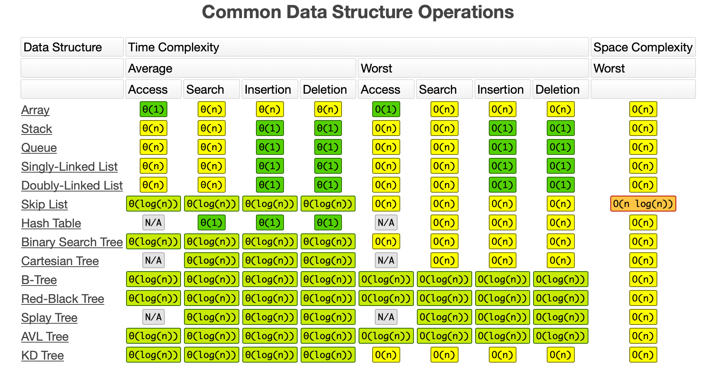

# ctci-cheat_sheet
Making a "cheat sheet" from CTCI as I go through the book

## Arrays and Strings

## Linked Lists
Can be single or doubly linked

### Time complexities
Insert at beginning of list in O(1)

Get Nth element in O(n)

## Recursive Algorithms
All recursive algorithms take at least O(n) space, where n=depth of recursive call

## Stacks
A stack uses LIFO ordering.
One case where stacks are often useful is in certain recursive algorithms. Sometimes
you need to push temporary data onto a stack as you recurse, but then remove them as
you backtrack (for example, because the recursive check failed). A stack offers an
intuitive way to do this.

A stack can also be used to implement a recursive algorithm iteratively.

## Queue
A queue uses FIFO ordering.
One place where queues are often used is BFS(breadth first search) or in implementing
a cache.

## Trees
Be comfortable in implementing in-order, post-order and pre-order traversal.

In-order traversal means to "visit" the left branch, then the current node, and finally,
the right branch.
Pre-order traversal visits the current node before it's children.
Post-order traversal visits the current node after it's children. In post-order traversal
the root is always the last node visited.

### Types of Trees
#### Binary Tree
Any Tree in which each node has up to two children.
#### Binary Search Tree
A binary search tree is a binary tree which imposes the condition that, for each node,
its left descendents are less than or equal to the current node, which is less than the right
descendents.
#### Complete Binary Tree
Complete binary tree has every level of the tree fully filled, except maybe the last level.
To that extend that the last level is filled, it's filled left to right.
#### Full Binary Tree
A full binary tree is a binary tree in which every node has either zero or two children.
#### Perfect Binary Tree
Perfect binary trees are both full and complete.

### Trie (Prefix Tree)
A trie is a variant of an n-ary tree in which characters are stored at each node. Each
path down the tree may represent a word.
A * (star) node is often used to indicate complete words.

### BFS and DFS(Pseudocode)
```
def DFS(root: Node):
  if root == None:
    return
  visit(root)
  root.visited = true
  for node in root.adjacent:
    if node.visited == False:
      search(node)

def BFS(root: Node):
  queue = Queue()
  root.visited = true
  queue.append(root)

  while queue:
    node = queue.dequeue()
    visit(node)
    for n in root.adjacent:
      if node.visited == False:
        n.visited = True
        queue.append(n)

```
#### Bi-directional search
Bidirectional search is used to find the shortest path between a source and destination
node. It operates by essentially running two simultaneous breadth-first searches, one
from each node. When their searches collide, we have found a path.

## Object-Oriented Design
### How to Aproach
#### 1. Handle ambiguity
OOD questions are often intentionally vague in order to test whether you'll make assumptions
or if you'll ask clarifying questions.

When being asked an OOD question, you should inquire who is going to use it and how they are
going to use it. Depending on the question, you might even want to go through the 'six W': who,
what, where, when, how, why

#### 2. Define the core objects
Consider what the core objects are going to be in the given scenario, and define them.

#### 3. Analyze relationships
Think about the relationships between the defined objects. Do they inherit one another?
Are they many-to-many or one-to-many? Ask clarifying questions from your interviewer.

#### 4. Investigate actions
At this point you should have a basic outline of your OOD. What remains is to define the actions
the objects will take and how they relate to each other. You may find that you have forgotten
some objects, and need to update your design.

### Design patterns
The singleton and factory design pattern are widely used in interviews.

## Recursion and Dynamic Programming

### How to Aproach
Recursive solutions, by defition, are built off of solutions to subproblems.

There are many ways to divide a problem into subproblems. Three of the most common approaches
to develop an algorithm are bottom-up, top-down, and half-half.

#### Bottom-up approach
The bottom-up approach is the most intuitive. We start with knowing how to solve the problem for a simple
case, like a list with only one element. Then we figure out how to solve for two elements, then three
and so on. The key here is to think about how you can build the solution for one case off of the previous
case (or multiple previous cases).

#### Top-down approach
The top down approach can be more complex, since it's less concrete. But sometimes, it's the best way
to think about the problem.

In these problems, we think about how we can divide the problem for case N into subproblems.

#### Half-half approach
It's often effective to divide the data set in half.

For example, binary search works with a 'half-half' approach. When we look for an element in a sorted
array, we first figure out which half of the array contains the value. Then we recurse and search for
it in that half.

Merge sort tis also a 'half-half' approach. We sort each half of the array and then merge together the
sorted halves.

### Recursive vs Iterative solutions
Recursive algorithms can be very space inefficient. If your algorithm recurses to a depth of n, it
uses at least O(n) memory.

Before diving into recursive code, ask yourself how hard it would be to implement it iteratively,
and discuss the tradeoffs with your interviewer.

### Dynamic Programming
Dynamic programming is mostly just a matter of taking a recursive algorithm, and finding the
overlapping subproblems(that is, repeated calls). You then cache those results for future
recursive calls.

## System Design and Scalability

### Handling the questions

#### Communicate
A key goal of system design questions is to evaluate your ability to communicate.
Stay engaged with the interviewer. Ask them questions. Be open about the issues of your system.

#### Go broad first
Don't dive straight into the algorithm part of get excessively focussed on one part.

#### Use the whiteboard
Using a whiteboard helps your interviewer follow your proposed design. Get up to the whiteboard
in the very beginning and use it to draw a picture of what you're proposing.

#### Acknowledge interviewer concerns
Your interviewer will likely jump in with concerns. Don't brush them off; validate them.
Acknowledge the issues your interviewer points out and make changes accordingly.

#### Be careful about assumptions
An incorrect assumption can dramatically change the problem. For example, if your system
produces analytics / statistics for a dataset, it matters whether those analytics must be totally
up to date.

#### State your assumptions explicitly
When you do make assumptions, state them. This allows your interviewer to correct you if you're
mistaken, and shows that you at least know what assumptions you're making.

#### Estimate when necessary
In many cases, you might not have the data you need. For example, if you're designing a web crawler,
you might need to estimate how much space it will take to store all the urls. You can estimate this with
other data you know.

#### Drive
As the candidate, you should stay in the driver's seat. This doesn't mean you don't talk to your interviewer;
In fact, you must talk to your interviewer. However, you should be driving through the question. Ask questions.
Be open about tradeoffs. Continue to go deeper. Continue to make improvements.

These questions are largely about the process rather than the ultimate design.

### Design step by step

#### Step 1: Scope the problem
You can't design a system if you don't know what you're designing. Scoping the problem is important
because you want to ensure that you're building what the interviewer wants and because this might be
something that interviewer is specifically evaluating.

If you're asked something such as "Design TinyURL" you'll want to understand what exactly you need to
implement. Will people be able to specify their own short URLs? Or will it all be auto-generated? Will
you need to keep track of any stats on the clicks? Should the URLs stay alive forever, or do they have a timeout.

#### Step 2: Make reasonable assumptions
It's okay to make some assumptions when necessary, but they must be reasonable. It is not reasonable to assume that your system only needs to process 100 users per day, or to assume that
you have infinite memory available.

However it might be reasonable to design for a max of one million new URLs per day. Making this assumption can
help you calculate how much data your system might need to store.

Some assumptions might make some "product sense" (which is not a bad thing). For example, is it okay for
the data to be stale by a max of ten minutes? That all depends. If it takes 10 minutes for a just-entered URL
to work, that's a deal-breaking issue. People usually want these URLs to be active immediately. However, if
statistics are ten minutes out of date, that might be okay. Talk to your interviewer about these sorts of assumptions.

#### Step 3: Draw the Major Components
Draw a diagram of the major components. You might have something like a frontend server(or set of servers) that pull data from the backend's data store. You might have another set of servers that crawl the internet for some data, and another set that process analytics. Draw a picture of what this system might look like.

#### Step 4: Identify the Key issues
Once you have a basic design in mind, focus on the key issues. What will be the bottlenecks or major challenges in the system?

For example, if you were designing TinyURL, one situation you might consider is that while some URLs will be infrequently accessed, others can suddenly peak. This might happen if a URL is posted on Reddit or another popular forum. You don't necessarily want to constantly hit the database.

#### Step 5: Redesign for the key issues
Once you have identified the key issues, it's time to adjust your design for it. You might find that it involves a major redesign or just some minor tweaking (like using a cache).

Stay up at the whiteboard here and update your diagram as your design changes.

Be open about any limitations in your design. Your interviewer will likely be aware of them, so it's important to communicate that you're aware of them, too.

### Algorithms that scale: Step by Step
Sometimes you're not asked to design a whole system, but just an algorithm or feature.

#### Step 1: Ask questions
Ask questions to really understand the problem. The interviewer might have left out information(intentionally or unintentionally).

#### Step 2: Make Believe
Pretend the data can all fit on one machine without limitations, how would you solve it in that case?

#### Step 3: Get Real
Go back to the original problem. How much data can fit on one machine, and what problems will appear when you split the data? Common problems are how to divide the data and how one machine would identify where to look up a different piece of data?

#### Step 4: Solve problems
Think about how to solve the issues you identified in step 2. Sometimes a solution can be to remove the issue completely.

## Sorting and Searching

### Common sorting Algorithms

#### Bubble sort | Runtime: O(n2) average and worst case. Space: O(1)

#### Selection sort | Runtime: O(n2) average and worst case. Space: O(1)

#### Merge Sort | Runtime: O(n log(n)) average and worst case. Space: depends

#### Quick sort | Runtime: O(n log(n)) average, O(n2) worst case. Space: O(log(n))

#### Radix Sort | Runtime: O(kn)

### Searching algorithms

#### Binary search | RuntimeL O(log (n)) average and worst

# System Design Cheat sheet

## Core concepts

### Back of the envelope calculations
#### Powers of two table

```
Power           Exact Value         Approx Value        Bytes
---------------------------------------------------------------
7                             128
8                             256
10                           1024   1 thousand           1 KB
16                         65,536                       64 KB
20                      1,048,576   1 million            1 MB
30                  1,073,741,824   1 billion            1 GB
32                  4,294,967,296                        4 GB
40              1,099,511,627,776   1 trillion           1 TB
```

#### Latency numbers every programmer should know

```
Latency Comparison Numbers
--------------------------
L1 cache reference                           0.5 ns
Branch mispredict                            5   ns
L2 cache reference                           7   ns                      14x L1 cache
Mutex lock/unlock                           25   ns
Main memory reference                      100   ns                      20x L2 cache, 200x L1 cache
Compress 1K bytes with Zippy            10,000   ns       10 us
Send 1 KB bytes over 1 Gbps network     10,000   ns       10 us
Read 4 KB randomly from SSD*           150,000   ns      150 us          ~1GB/sec SSD
Read 1 MB sequentially from memory     250,000   ns      250 us
Round trip within same datacenter      500,000   ns      500 us
Read 1 MB sequentially from SSD*     1,000,000   ns    1,000 us    1 ms  ~1GB/sec SSD, 4X memory
Disk seek                           10,000,000   ns   10,000 us   10 ms  20x datacenter roundtrip
Read 1 MB sequentially from 1 Gbps  10,000,000   ns   10,000 us   10 ms  40x memory, 10X SSD
Read 1 MB sequentially from disk    30,000,000   ns   30,000 us   30 ms 120x memory, 30X SSD
Send packet CA->Netherlands->CA    150,000,000   ns  150,000 us  150 ms

Notes
-----
1 ns = 10^-9 seconds
1 us = 10^-6 seconds = 1,000 ns
1 ms = 10^-3 seconds = 1,000 us = 1,000,000 ns
```

Handy metrics based on numbers above:

* Read sequentially from disk at 30 MB/s
* Read sequentially from 1 Gbps Ethernet at 100 MB/s
* Read sequentially from SSD at 1 GB/s
* Read sequentially from main memory at 4 GB/s
* 6-7 world-wide round trips per second
* 2,000 round trips per second within a data center

### Consistent Hashing
Consistent hashing is a concept in load balancing where we use hashes of request id's to uniformly do load balancing on servers. We expect that our hashing function will be uniformly random.

For constitent hashing, we create a ring "array" of values from 0 to M-1. We then hash our server ids and map the modulo of hash(server_Id) % M to a point in the ring. So whenever we are hit by a request, we modulo it with M and then go clockwise from the value in the ring until we hit a server. This allows us to add servers in an easier way compared to just using hash(request_id) % num_of_servers, where we would have to remap all the requests and invalidate all caches and data on servers.

The benefit of this architecture is that if one of our servers dies, the requests it was handling will be sent to the next server in the ring. This would not be possible with just assigning a certain hash modulo to a certain server.

### Availability vs Consistency(CAP theorem)
In a distributed computer system, you can only support two of the following guarantees:
- Consistency - Every read receives the most recent write or an error
- Availability - Every request receives a response, without guarantee that it contains the most recent version of the information
- Partition Tolerance - The system continues to operate despite arbitrary partitioning due to network failures
Networks aren't reliable, so you'll need to support partition tolerance. You'll need to make a software tradeoff between consistency and availability.

#### CP - consistency and partition tolerance

Waiting for a response from the partitioned node might result in a timeout error.  CP is a good choice if your business needs require atomic reads and writes.

#### AP - availability and partition tolerance

Responses return the most recent version of the data available on a node, which might not be the latest.  Writes might take some time to propagate when the partition is resolved.

AP is a good choice if the business needs allow for or when the system needs to continue working despite external errors.

### Consistency patterns

With multiple copies of the same data, we are faced with options on how to synchronize them so clients have a consistent view of the data.

#### Weak consistency

After a write, reads may or may not see it.  A best effort approach is taken.

This approach is seen in systems such as memcached.  Weak consistency works well in real time use cases such as VoIP, video chat, and realtime multiplayer games.  For example, if you are on a phone call and lose reception for a few seconds, when you regain connection you do not hear what was spoken during connection loss.

#### Eventual consistency

After a write, reads will eventually see it (typically within milliseconds).  Data is replicated asynchronously.

This approach is seen in systems such as DNS and email.  Eventual consistency works well in highly available systems.

#### Strong consistency

After a write, reads will see it.  Data is replicated synchronously.

This approach is seen in file systems and RDBMSes.  Strong consistency works well in systems that need transactions.

## Twitter
We care about eventual consistency - Availability before consistency.

Tradeoffs Time vs Space.
Twitter is very read-heavy. The data that is being read is usually just text tweets, and a minority of video or image tweets. The text tweets don't take up a lot of memory, only 140 characters so we can really store most of it in memory to optimize for time in this case.

### Core Features
- Tweets
- Timeline
  - User(users timeline)
  - Home(time of all people user follows)
- Following

### Solution
#### Tweeting
When tweeting - you will post your tweet and it will hit a load balancer, which will pass the tweet data to a redis instance so it can be saved in memory - and this data is replicated on 3 redis instances for availability. The redis machines have to be very large memory-wise. The user home timeline is stored and updated in the redis db, and it can be optimized by not storing the home timelines in redis for users who haven't been active for a longer period of time.

An edge case for tweeting will be users with many followers, let's say 1M+. When they tweet, we have to write 3M+ times to redis lists, which is a large computational load. In order to optimize this, we can use a mix of in-memory and async calls. We could save tweets from users with large ammount of followers into an RDMBS, and they can be merged at page load with redis lists for full home timeline.

We get the followers redis lists from an SQL db listing all followers

#### Timeline
Bob accesses his timeline with a get method. The request hits a load balancer, and the load balancer will direct us to the least occupied redis instance where Bob's timeline list is saved. We only hit one redis instance.

#### Redis
We have to know which 3 redis instances the load balancer should redirect us. We will do this with hash maps, a hash lookup using the user_id of bob.

## Messaging service (Whatsapp, WeChat)
Ask about features first. What devices should it be on, is it video also, audio, or just text? Is it one to one or group chats? We aren't storing permanent chat data on servers.

### Core features
- One on One chat: Text only
- Sent/Delivered/Read
- Push notifications

### Solution
#### Chat
Let's say we have two people chatting, Bob and Alice. When they send messages, they have to go through our servers and that will be our bottleneck. We want to horizontally scale the servers, and use async in the solution as it doesn't matter for all parties to be updated at the same time.
Our servers have queues for message sending, with a queue being assigned per chat where messages are stored.
An issue that can happen is that our messages are stored in multiple servers and queues due to availability or some other issue, where we can lose the order of messages so when they are received, it is in the wrong order.

#### Send/Delivered/Read
Handled by TCP on servers. If our message is sent to the server, we will know with ACK. When the message is received on device, server knows with ACK and can return back to sender. When the message is read, we can push it as a "message" to server queue and notify the sender.

#### Push notifications
They are different from text messages. They have to be delivered to user when he is online, but we do not expect interaction with it. It's probably best to use the push notification delivery system is used from the phone OS, e.g. Google push notifications.
It's a fire and forget system. If we get ACK that the push notification was received, we can delete all data related to it from our servers.

## Bitly/TinyURL

### Assumptions
30M users/month
1M users/day
7 characters length of shortened url

#### Data capacity model
long_url -> 2kb(2048 chars)
short_url -> 17bytes(17chars)
created_at -> 7bytes(7chars)
exp-at -> 7bytes(7chars)
~2.03kb per url
30M users/month -> 60.7GB/Month -> 0.7 TB/year -> 3.6TB/5 years

### API
create_tiny(long_url) -> short_url
get_long(short_url) -> long_url

### Core functionalities
- hashing the url

### Solution
#### Hashing the url
We have several options for hashing, with most common being MD5 and Base62. Base62 gives us 3.5 trillion options at 7 characters length. Running our system with 1000/s writes, it would take us over 100 years to run out of unique id's. We want to prevent data corruption by the chance of getting the same short_url hash, so we have a couple of options. We can either query the database to check if the short_url is already present, and to prevent insert in that case. This is costly, and does not work with a scalable system with multiple instances.
Another option is to use a database level function, like only insert if not present, and like that guarantee we won't have corrupted data. But these kind of functions are only available in RDBMS.

So this solution would not work and be scalable. An option that we can do is add a counter to every request that will be received, and we can hash the counter every time.
An issue here can be on scalable multiple instance systems, we would need to have a counter service to keep track of the counter on multiple instances. This way we are introducing a single point of failure, that can create difficulties for us.
We can solve this problem using zookeeper, a coordination service. We can store slices of the range of our counter in zookeeper, so whenever a service comes online, it can ask zookeeper for a range of counter, and we can assign it one of the available ones.

This way we can insert into the DB without worry of collision. Also on input of url, we should also add it to the cache immediately, so when the user requests the long url back, our servers can take it from the cache instead of the DB.

#### Database
We can use a RDBMS but we run into an issue with horizontal scaling using sharding there as we might have to use consistent hashing and it's going to increase our complexity.
Because we are going to have a lot of users per month, and it's hard to scale RDBMS horizontally, we can look into NoSQL solutions. But the issue there is with eventual consistency, it will take some time for data to replicate to a different node. The good thing is that it's highly available and easier to scale.

## Uber/Lyft/Ola
A taxi booking service like uber has a supply and demand system of users and drivers. This system is based on maps and location data. Uber uses the google S2 library for this, which splits the world into cells of a certain size, and each cell is given a unique id.
So we can spread this data in a distributed system, and with the id and consistent hashing, we can know on which server is the data stored.

We will be using web sockets for asynchronous connections with cabs and users.

### Assumptions

### Core functionalities
- Supply and Demand (user and driver matching)
- Driver GPS tracking
- Find nearest cab - Dispatch optimisation

### Solution

#### Driver GPS tracking
Cabs will be sending geo data every 4 seconds to a Kafka REST API

#### Dispatch optimisation
The dispatch optimisation is built in a node.js for event driven and asynchronous programming. Uber uses consistent hashing for distributing workload between workers.
We have a supply and demand service in dispatch optimisation which is is sending requests to the workers who are calculating the cells(S2 geo) near the user who called the cab. It calculates who are the cabs near the user and then the worker sends the data back to the SnD service, who returns the data to the cabs with web sockets.

## Redis - Distributed cache system design

### Assumptions/Requirements
- We want to store terabytes of data, as we are trying to build a very large cache
- Expecting 50k to 1M OPS
- ~1ms latency
- Eviction policy LRU
- 100% availability of servers
- Scalable

### Core features
- Write Through - this means that data will be saved to the cache, then to the db and only if both are successfull will it return an ACK
- Write Around - Just write to db, data will be sent to cache only on read miss in cache
- Write Back - Data will be saved to the cache, who responds with ACK back, and then a sync service will save data from cash to db

### Solution
The data structure we are going to use for our distributed cache is a hash table. The issue with hash tables is that we can get collisions on key hashing and we can solve this with a couple of different approaches.
- Linked list approach is if we find a collision we save the keys and values in a linked list, so when we lookup the value we will have the data in the linked list
- Open addressing
- Robin hood hashing
Another issue is that cache memory is really expensive, so we scale it indefinitely. To solve this issue we have to build our cache eviction policy, and for this we can use LRU, which is one of the best options for a cache.

For the cache internals implementation we have different options. We need to enable the CRUD operations. The best option for implementing internals is an event driven logic, with an event queue and an indefinitely running event loop which sends the requests to the thread pool who have a callback function to send a response once they are done with their memory operation.

In order to have our cache persistence, in case of  a server failure, we can use 2 options:
- Regular interval snapshot - dump the cache and save it to a dump file from which we can rebuild data later
- Log reconstruction - Keep a log file of all operations being done on memory, so in case of cache fail, we can rebuild the cache from the log file

As far as availability, we can try having servers with replicated data, but this adds extra latency and the servers need some time to sync up so we might not have the correct data all the time.
We can make the replica servers slaves of master servers, so we won't be distributing requests and will avoid most of the issues like this.

# Time and space complexities and common python operations

## Time complexities
O(1) - Constant Time
O(log n) - Logarithmic time
O(n) - Linear time
O(n log n) - Quasilinear time
O(n^2) - Quadratic time
O(2^n) - Exponential time
O(n!) - Factorial time

## Common Data Structure Operations
Taken from https://www.bigocheatsheet.com

